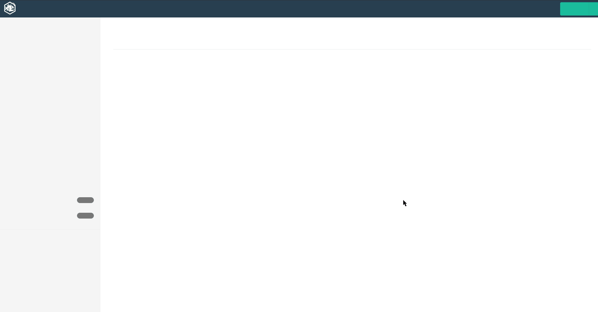
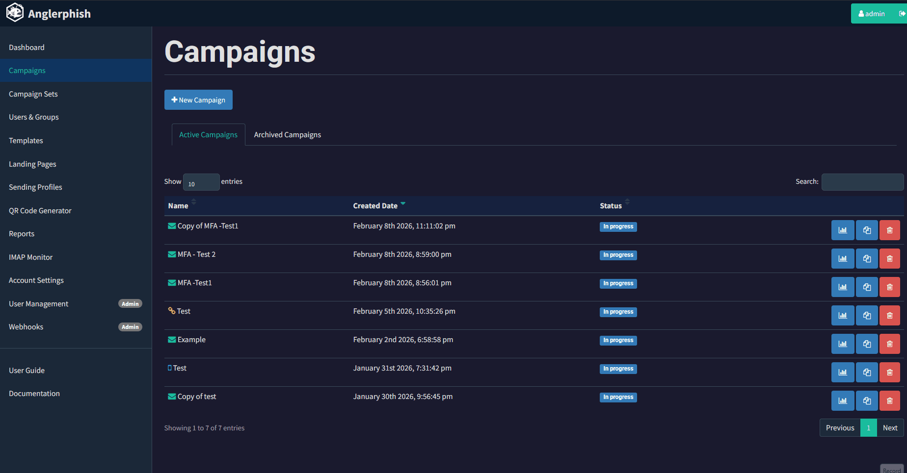
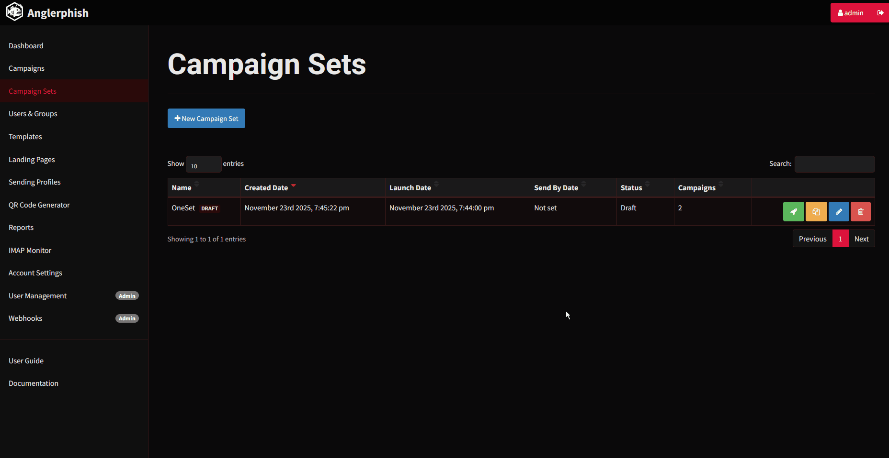
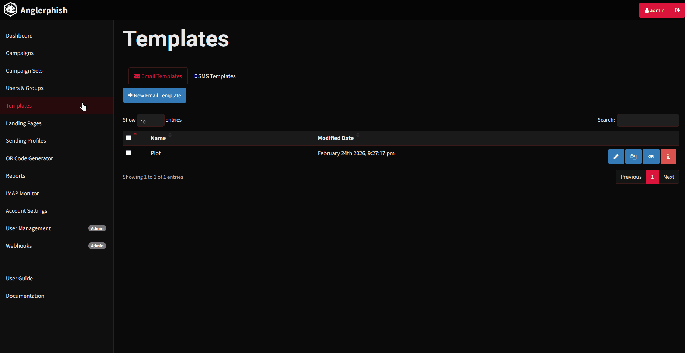

<div align="center">
<h1>Anglerphish</h1>
</div>

Anglerphish is an enhanced, feature-rich fork of [Gophish](https://github.com/gophish/gophish) aimed at providing more flexible campaign management, expanded phishing vectors, improved reporting capabilities, and numerous quality‑of‑life enhancements.

See also the Medium [article](https://medium.com/@gpetro/anglerphish-6dc3e5520242).

---

## Table of Contents

- [Table of Contents](#table-of-contents)
- [🚀 Features and Enhancements](#-features-and-enhancements)
  - [Campaign Management \& Flexibility](#campaign-management--flexibility)
  - [New Campaign Vectors](#new-campaign-vectors)
  - [Reporting \& Tracking](#reporting--tracking)
  - [Templates, Variables, \& Group Management](#templates-variables--group-management)
  - [UI \& User Experience](#ui--user-experience)
  - [Security](#security)
  - [Stealth Tweaks](#stealth-tweaks)
  - [Potential Expansion Ideas - (Not Guaranteed)](#potential-expansion-ideas---not-guaranteed)
  - [Visual Previews](#visual-previews)
- [A fork based on original Gophish v0.12.1:](#a-fork-based-on-original-gophish-v0121)
  - [Gophish: Open-Source Phishing Toolkit](#gophish-open-source-phishing-toolkit)
  - [Install](#install)
  - [Building From Source](#building-from-source)
  - [Setup](#setup)
  - [Documentation](#documentation)
  - [Issues](#issues)
  - [License](#license)


---

## 🚀 Features and Enhancements

### Campaign Management & Flexibility

| Feature | Description | Relevant Context / Use Case |
| :--- | :--- | :--- |
| **Campaign Sets** | Enables the creation and configuration of **multiple campaigns simultaneously**. Users can save them as drafts, modify, and launch them all at once. | Ideal for large-scale, multi-vector, or multi-stage assessments. |
| **Per-Campaign URL Parameters** | Allows **unique URL parameters** to be used for each campaign instead of being limited to a global `rid`. | Better isolation and tracking across different campaigns. |
| **Campaign Summary Before Launching** | Provides a **summarized overview** of all configured parameters (targets, template, landing page, etc.) **before launching**. | Essential for avoiding misconfiguration and ensuring everything is set up correctly. |
| **Dashboard Filtering** | Allows **filtering the campaign list** on the dashboard to show only **Email**, **SMS**, or **Generic** campaigns. | Improved management and viewing of campaigns on the main dashboard. |
| **Generic Campaigns** | Run flexible campaigns not tied to email/SMS. Creates trackable links that can be distributed via any channel (QR codes, social media, flyers, etc.). | Ideal for scenarios where the phishing link is delivered outside of email/SMS, such as QR code posters, USB drops, or manual distribution. |
| **QR Code Generator** | Built-in tool to **generate QR codes**. | Useful for Generic Campaigns and other phishing scenarios requiring QR code delivery. |
| **Resend Failed Emails** | Re-queue **all failed/errored emails** in a campaign with one click, or resend to a **single recipient** directly from the results page. | Recovers from SMTP errors or transient delivery failures without restarting the campaign. |

---

### New Campaign Vectors

| Feature | Description | Relevant Context / Use Case |
| :--- | :--- | :--- |
| **SMS Campaigns** | Adds support for **SMS-based campaigns** alongside traditional email. Includes dedicated SMS profiles (Twilio and Vonage) and SMS template creation. | Expanding phishing simulations beyond email. |
| **MFA Simulation** | Enables **Multi-Factor Authentication simulation** on landing pages. After credential submission, sends a verification code via SMS to the target's phone number. Tracks MFA events: Code Sent, Verified, Failed. | Simulates real-world MFA bypass scenarios and tests user behavior when presented with fake MFA prompts. Configurable code length, type (numeric/alpha/alphanumeric), custom SMS message, and sender ID. |
| **HTTP Basic Auth Landing Pages** | Enables **basic authentication landing page campaigns** based on [edermi/gophish_mods](https://github.com/edermi/gophish_mods/tree/master). | Allows simulation of attacks requiring Basic Auth credentials. |
| **QR Code Embedding in Campaigns** | Integrates **QR code campaigns**, based on [Evil-Gophish](https://github.com/fin3ss3g0d/evilgophish.git). | Allows phishing links to be delivered via scannable QR codes. |
| **Email Replied** | Tracks when users **reply to phishing emails** (with an additional chart). | Recognizes replies as a form of sensitive data disclosure, not just clicks or form submissions. |

---

### Reporting & Tracking

| Feature | Description | Relevant Context / Use Case |
| :--- | :--- | :--- |
| **Reports Page** | New reporting feature to **export campaign results and metrics as Word or Excel files**, with **Privacy Options** to anonymize results. | Easier sharing and better presentation of results. |
| **Reported Phishing Monitoring Enhancement** | Improved handling of reported phishing emails, now recognizing **all variations of URL parameters** across active campaigns. | More accurate tracking of reported phishing attempts, even if parameters are slightly modified. |
| **IMAP Monitor** | Dedicated view for received emails in the IMAP inbox that are **unrelated to any Gophish campaign**. | It can help track general user reporting habits outside of active simulations, email delivery errors, etc.  |
| **X-Tracked Header Handling** | Supports custom **`POST` requests containing the header `X-Tracked`**. When posted, the system parses the URL parameters and generates a `.csv` log entry. | Tracking for scenarios like **macro-enabled `.doc`/`.xls` files** or custom POST requests from landing pages. |
| **Multiple IMAP Configurations** | Supports adding and managing **multiple IMAP server profiles** (Email Replied and Email Reported types). | Supports dedicated inboxes for different tracking needs. |

---

### Templates, Variables, & Group Management

| Feature | Description | Relevant Context / Use Case |
| :--- | :--- | :--- |
| **New Template Variables** | Introduces **`{{.Custom}}`**, **`{{.Phone}}`**, **`{{.CurrentDateTime}}`**, **`{{.CurrentDate}}`**, **`{{.CurrentTime}}`**, and **`{{.CurrentTime24}}`** for use in emails, landing pages, and attachments. | Enables deeper personalization with custom data fields, phone numbers for SMS, and dynamic time-sensitive scenarios. |
| **URL Templates** | Provides **ready-to-use URL examples** of popular services to modify, and allows for the creation/reuse of URL templates. | Speeds up campaign creation by offering common, complex URL structures. |
| **Preview Templates / Landing Pages** | Added the ability to **preview Email, SMS, and Landing Page Templates directly**—no need to open the editor. | Faster workflow and template QA. |
| **Global Variables** | Define **system-wide variables** (e.g. company name, helpdesk URL) once and reuse them across email/SMS templates and landing pages. | Eliminates repetition and keeps campaigns consistent without editing each template individually. |
| **Group Locking** | **Lock groups** to prevent accidental edits or deletions while they are in active use. | Protects target lists during live campaigns from being modified unintentionally. |
| **Group Export** | Supports **exporting user groups to `.csv`** for easy backup and editing. | Simplifies group management and allows for external modifications. |

---

### UI & User Experience

| Feature | Description | Relevant Context / Use Case |
| :--- | :--- | :--- |
| **Dark Theme** | Provides a **dark mode option** for the entire UI. Can be enabled in **Settings → UI Settings**. | Reduces eye strain and provides a modern, sleek appearance for users who prefer dark interfaces. |
| **In-App API Documentation** | Built-in **API Documentation page** accessible from the UI, documenting all Anglerphish API endpoints including new ones for SMS, Campaign Sets, QR codes, and more. | Enables developers and integrators to quickly reference available APIs without leaving the application. |

---

### Security

| Feature | Description | Relevant Context / Use Case |
| :--- | :--- | :--- |
| **Database Encryption** | Optional **AES-256-GCM encryption** for sensitive database fields (SMTP passwords, SMS provider credentials, IMAP passwords and Captured Data). Enabled via `ANGLERPHISH_ENCRYPTION_KEY` environment variable. | Protects sensitive credentials at rest. Includes CLI commands for key generation, migration to encrypted state, and reverse migration back to plaintext. Backward compatible—works with or without encryption enabled. |

---

### Stealth Tweaks

| Feature | Description | Relevant Context / Use Case |
| :--- | :--- | :--- |
| **Transparency & Header Removal** | Completely removed GoPhish's **transparency request handler** (`+` suffix endpoint), **`X-Server`** response header, and **`X-Mailer`/`X-Contact`** email headers — known GoPhish detection fingerprints. | Removes basic detectability hints for Anglerphish. |
| **Default Landing Page** | A **default Error 404 landing** when visiting the domain, based on [edermi/gophish_mods](https://github.com/edermi/gophish_mods/tree/master). The page content is **fully editable from Settings**. | Provides a clean 404 page for direct domain visits instead of a blank page, customizable without touching code. |

---

### Potential Expansion Ideas - (Not Guaranteed)

| Feature                                          | Short Explanation                                                                                                   |
| ------------------------------------------------ | ------------------------------------------------------------------------------------------------------------------- |
| **MS Teams Campaign Integration**                | Send phishing simulations directly via Microsoft Teams messages.                                   |
| **Evilginx Integration**                         | Integrate with Evilginx for advanced red-team simulations.         |
| **Randomized Email Template Sending to Targets** | Automatically rotate between multiple templates so each target receives a different  phishing message. |
|**Other Integrations**|Integrations such as Direct Email Injection (DMI), internal support for Turnstile.|

---

### Visual Previews







## A fork based on original Gophish v0.12.1:

 [](https://godoc.org/github.com/gophish/gophish)

### Gophish: Open-Source Phishing Toolkit

[Gophish](https://getgophish.com) is an open-source phishing toolkit designed for businesses and penetration testers. It provides the ability to quickly and easily setup and execute phishing engagements and security awareness training.

### Install

Installation of Anglerphish remains dead-simple - just download and extract the zip containing the [release for your system](https://github.com/geopetro/anglerphish/releases/), and run the binary. Anglerphish has also binary releases for Windows, Mac, and Linux platforms.

### Building From Source

To build Anglerphish from source, simply run ```git clone https://github.com/geopetro/anglerphish.git``` and ```cd``` into the project source directory. Then, run ```go build```. After this, you should have a binary called ```gophish``` in the current directory.

### Setup
After running the Gophish binary, open an Internet browser to https://localhost:3333 and login with the default username and password listed in the log output.
e.g.
```
time="2020-07-29T01:24:08Z" level=info msg="Please login with the username admin and the password 4304d5255378177d"
```

### Documentation

Documentation for Anglerphish - Documentation section includes several Anglerphish additions such as newly added API Endpoints.

Documentation of the original gophish can be found on the official [site](http://getgophish.com/documentation).

### Issues

🐞 Found a bug? Feel free to [file an issue](https://github.com/geopetro/anglerphish/releases/issues/new) — feedback is always welcome!

### License
```
MIT License

Copyright (c) 2013–2020 Jordan Wright
Copyright (c) 2025–2026 George Petropoulos

Permission is hereby granted, free of charge, to any person obtaining a copy
of this software and associated documentation files (the "Software"), to deal
in the Software without restriction, including without limitation the rights
to use, copy, modify, merge, publish, distribute, sublicense, and/or sell
copies of the Software, and to permit persons to whom the Software is
furnished to do so, subject to the following conditions:

The above copyright notice and this permission notice shall be included in
all copies or substantial portions of the Software.

THE SOFTWARE IS PROVIDED "AS IS", WITHOUT WARRANTY OF ANY KIND, EXPRESS OR
IMPLIED, INCLUDING BUT NOT LIMITED TO THE WARRANTIES OF MERCHANTABILITY,
FITNESS FOR A PARTICULAR PURPOSE AND NONINFRINGEMENT. IN NO EVENT SHALL THE
AUTHORS OR COPYRIGHT HOLDERS BE LIABLE FOR ANY CLAIM, DAMAGES OR OTHER
LIABILITY, WHETHER IN AN ACTION OF CONTRACT, TORT OR OTHERWISE, ARISING FROM,
OUT OF OR IN CONNECTION WITH THE SOFTWARE OR THE USE OR OTHER DEALINGS IN
THE SOFTWARE.

----------------------------------------------------------------
Fork Attribution
----------------------------------------------------------------

Anglerphish is an enhanced fork of Gophish v0.12.1,
originally created by Jordan Wright.

----------------------------------------------------------------
Intended Use Notice (Non-Binding Advisory)
----------------------------------------------------------------

Anglerphish is intended exclusively for authorized security
testing, phishing simulations, user awareness training,
and defensive cybersecurity research.

Users are responsible for ensuring compliance with all
applicable laws and obtaining proper authorization before use.

This notice does not modify or supersede the terms of the MIT License.
```
